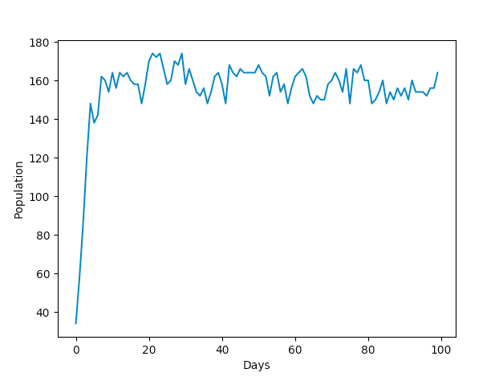

A collection of code inspired by [this series of youtube videos](https://www.youtube.com/watch?v=oDvzbBRiNlA&list=PLKortajF2dPBWMIS6KF4RLtQiG6KQrTdB) by [Primer.](https://www.youtube.com/channel/UCKzJFdi57J53Vr_BkTfN3uQ)

I've organized it by each concept examined that I found interesting.

### table of contents
1. [existence](#existence)
    1. [raindrops](#raindrops)
    2. [pigeons](#pigeons)
2. [aggression](#aggression)
    1. [doves only](#dovesonly)
    2. [doves and hawks](#dovesandhawks)

# existence <a name="existence"></a>
The first concept we'll be looking at may not be completely relevant to the final natural selection model, but it helps start looking at the problem in a more mathematical and computational light. Why does something exist? Our definition is simple:
* It was created
* It hasn't been destroyed
For this reason, our aim in this module will be to give organisms birth-rates, death-rates, and replication-rates and see how their populations grow. 
## raindrops <a name="raindrops"></a>
In our first simulation, we have a probability that a new organism will be born, and a probability for each organism that it will die. An equation for the predicted equilibrium can be derived from  to be . I have implemented a class for this type of simple organism that I call an _existor_. Extracts from the Python class are shown below. To view the full code, view the project on GitHub. 

```python
class Existor(object):
    def __init__(self, population, birth_rate, death_rate):
        self.population = population
        self.birth_rate = birth_rate
        self.death_rate = death_rate

    # Updates population based on birth and death rates
    def update(self):
        if random.randint(0, 100) < self.birth_rate:
            self.population += 1
        for organism in range(self.population):
            if random.randint(0, 100) < self.death_rate:
                self.population -= 1

    # Returns the predicted equilibrium value based on our equation
    def getEquilibrium(self):
        return(self.birth_rate/self.death_rate)
```
Defining an instance of an Existor as `raindrop = Existor(0, 100, 10)`, we get the following population graph.\


The predicted population based on our equation was pretty close to the actual mean population. The reason for the oscillation is because even if there were more organisms than the equilibrium, that would cause the death-rate to be higher than the birth-rate, bringing the population back to equilibrium. 

## pigeons <a name="pigeons"></a>
However, real-life organisms are different from raindrops in the sense that they can reproduce; to fix this, we can add a replication rate which modifies the equilibrium equation to be . The plot for Replicators is shown below. Since Replicator is a child class of Existor I have not included the code here. \


# aggression <a name="aggression"></a>
The second concept is the trait of aggression, and how it affects the population dynamic. In my code, I've simulated the classic game-theoretic _hawks and doves_ approach to the problem. Following is a short description of the algorithm. 
* Simulation runs for a specified number of days, and consists of a specified number of locations
* Each location has two pieces of food
* Each day, the location of each organism is randomized.
  * If an organism has a location to itself, it eats both pieces of food and can reproduce
  * If 2 doves meet, they each eat 1 piece and survive to the next day, but don't reproduce
  * If a dove and a hawk meet, the hawk takes more food, so it can reproduce, though the dove does not survive
  * If 2 hawks meet, this leads to a fight and they both do not survive
  * If an organism enters an occupied location, it does not survive

The table below summarizes the encounters and their consequences. 


|      | If dove            | If hawk           |
|------|------------------|----------------|
| meets dove | survive, survive | reproduce, die |
| meets hawk | die, reproduce   | die, die       |

## doves only <a name="dovesonly"></a>
I first simulated a dove-only ecosystem, which started with 20 doves, had 100 unique locations, and ran for 100 days. 

```python
# Initial populations of doves
doves = 10000

# Total number of days the simulation will run for
days = 200
# Number of available locations with food
lnum = 100
```
The location allocation process is simple, as shown below. The complete code is available on GitHub. 

```python
for dove in range(doves):
        location = random.randint(0, lnum-1)
        # If vacant, occupy :)
        if locations[location] < 2:
            locations[location] += 1
        # Else, no food, die :(
        else:
            deaths += 1
            print(f'death at {location}')
```

The plot below shows how population varied with each day.


The population shoots up immediately as there is a lower chance that creatures are overallocated to a single location. The code prints births, deaths, and a daily summary to the console. On Day 1, this is what it looks like:


As quickly as Day 5, the deaths outnumber the births. This is because the population is greater than the number of locations, so fewer doves get to reproduce. This is shown in the console below.


## doves and hawks <a name="dovesandhawks"></a>

For this section, I had a similar approach, though I needed a new set of variables and processes to take care of hawks: a tally of deaths and births, and I had to code up the consequence table shown earlier on this page. Here is the addition for assigning locations to hawks.

```python
# Repeat location selection process for hawks
    for hawk in range(hawks):
        location = random.randint(0, lnum-1)
        if dove_locations[location] + hawk_locations[location] < 2:
            hawk_locations[location] += 1
        else:
            hawk_deaths += 1
            print(f'- hawk at {location}')
```

Here is a simple implementation of the consequence table:

```python
for location in dove_locations:
        at_location = dove_locations[location] + hawk_locations[location]

        if dove_locations[location] == 1 and at_location == 1:
            print(f'+ dove at {location}')
            dove_births += 1
        elif hawk_locations[location] == 1 and at_location == 1:
            print(f'+ hawk at {location}')
            hawk_births += 1
        elif hawk_locations == 1 and at_location == 2:
            print(f'+ hawk at {location}')
            print(f'- dove at {location}')
            hawk_births += 1
            dove_deaths += 1
        elif hawk_locations[location] == 2:
            print(f'-- hawk at {location}')
            hawk_deaths += 2
```
One potential flaw is that in my current code, the location allocation process is ordered: one set of creatures is completely allocated before the other. Since being allocated to an occupied location could lead to decreases in population, this is unfair to the species located later in the order. Even after I allocated hawks _before_ doves, I get the following population graph. 


